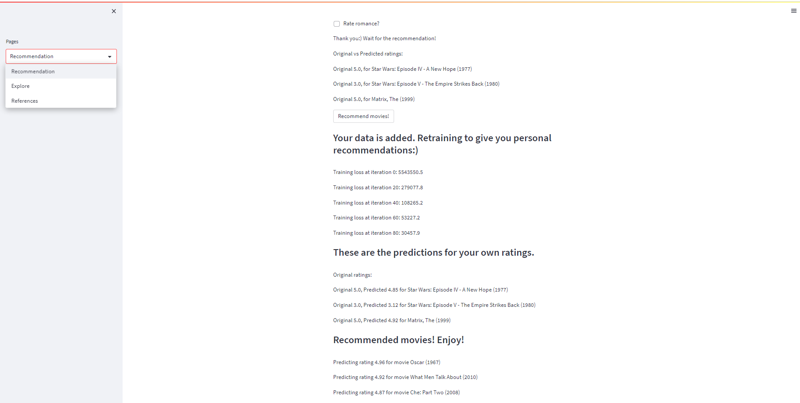

# Pelin Balci, Msc Industrial Engineer

## About
I hold a master's degree in industrial engineering and have a professional background in this field. My postgraduate 
education was completed at Bilkent University, one of the tops institution in industrial engineering in Turkey. 
In addition to my academic qualifications, I have supplemented my expertise by taking several online courses in machine 
learning and deep learning.

At present, I am working as a Senior Data Scientist at SabancıDx. My research interests are focused on Tiny ML and 
Natural Language Processing (NLP). These are particularly dynamic areas of study, and I am passionate about advancing my 
understanding of them.

I am using Python as my primary programming language for my various projects. Additionally, I strive to enhance my coding 
skills by utilizing LeetCode. My objective is to make meaningful contributions to the data science community in Turkey. 
Recently, I joined AYA (Açık Yazılım Ağı), an organization committed to helping those impacted by the devastating 
earthquake in Kahramanmaraş.  I have worked as a lead on data labeling for NER and Intent Classification Models. 
I am also a member of the Geeks of Data community, which offers a valuable platform for sharing my knowledge and learning 
from the experiences of others.

As a self-learner, I firmly believe in the importance of open-source software. I embrace this philosophy by sharing my 
codes on GitHub and publishing posts on my website and Medium. If you have any questions about my projects or wish to 
engage in an open-source initiative, please do not hesitate to contact me :)

## Contact
* Location: İstanbul, Turkey
* [LinkedIn](https://www.linkedin.com/in/pelin-balci/)
* [GitHub](https://github.com/pelinbalci)
* [Website](https://pelinbalci.com/)
* [Medium](https://medium.com/@balci.pelin)
* [HuggingFace EasyOCR App](https://huggingface.co/spaces/pelinbalci/easyocr)

## Key Skills
Operations Research, Mathematical Modeling, Simulation, Data Science, Machine Learning, Deep Learning, 
Tiny Machine Learning, Reinforcement Learning

## Software Knowledge
Python for Data Science (Pandas, Numpy, Simply Scikit-learn, Matplotlib, PyTorch, Simpy, TensorFlow, TensorFlow Lite, Streamlit), 
SQL, GAMS, Power BI

## Personal Projects
- [Movie Recommendation System](https://github.com/pelinbalci/MovieRecommendation)
- [Occupancy Detection with TensorFlow Lite & Neuton AI](https://github.com/pelinbalci/Tinyml_Occupancy_Detection)
- [Audio Classifier with Edge Impulse](https://pelinbalci.com/tinyml/2022/01/17/Audio-Classifier.html)
- [Motion Classifier with Edge Impulse](https://pelinbalci.com/tinyml/2022/01/01/Motion-Classifier.html)

## Work Experiences
- 2022 -  SabancıDx, Sr. Data Scientist 
    - NLP - OCR Project
    - Air Handling Unit Optimization with Reinforcement Learning
    - Demand prediction for retail company 
       - The aim of this project is to predict the demand from sub-parties and turn the prediction into order amount 
         according to the lead time and safety stocks
       - My responsibilities are re-framing the project scope, detailing the tasks, making code reviews, turning the 
         initial codes into production

- 2020 - 2022 SabancıDX, Data Scientist
    - Prediction of breakage in the production
        - The aim of this project is to recommend sensor values which minimizes the breakage in the final product for 
          industry. XGBoost Regression is used to make break prediction, a recommendation system is implemented which 
          suggests the best sensor values in the factory.
        - Model: XGBoost and Linear Regression
    - IOT Project: Air Quality IOT Product 
      - Building an IOT Product which measures the quality of data for offices. 
      - Controlling the measurements with Power BI & Python
    - Prediction of System Direction for an Energy Company
      - The aim of this project is predicting the hourly energy imbalance direction for the upcoming day.
      - Model: Neural Network Model is implemented with PyTorch 
      - Deployment: Databricks. Our model is being retrained every week and send a prediction mail to custome
      - Tools: Python, Databricks, SQL, Power BI
    - Delivery Optimization for a Fast-Food Company 
      - The aim of this project is improving delivery process and optimize shifts
      - Simulation for delivery process: I’ve written Simulation environment with Simpy library which shows the order’s 
        assignments and delivery times. Simulation is used to show the current state and the improvement of our new 
        approach before live test. 
      - Shift optimization: Targeted hourly driver numbers are calculated based on order distributions. The working 
        hours of full and part-time employees are determined by a mathematical model based on the targeted employees. 
        The objective function is minimizing the difference between the target driver and the assigned driver. 
        Simulation environment is used to analyze the proposed number of employees.
      - Tools: Python, SQL, Gurobi, Simpy, Power BI

    
- 2019 – 2020   Adphorus a Sojern Company, Sr. Data Analyst
    - Reporting the performance of algorithms 
      - Send status reports by email 
      - Tools: Facebook API, Python, SQL
    - A/B Testing 
      - Sampling Algorithms, Statistical Tests 
      - Facebook Digital Marketing

    
- 2017 – 2019 	Enerjisa Sales, Commodity Portfolio Management Specialist
    - Mark to Market Reporting System Project 
      - Design the reporting tool with IT Department 
      - Keep versions to make comparisons with budgets 
      - Make User Tests 
      - Control Profit and Loss Calculations 
      - Prepare Daily, Weekly, Yearly Reports
    - Process development
    - Customer based demand analysis
    - Prepare hedging strategies in terms of electricity in MW and dollar
    - Calculate energy prices for customers considering dollar, market conditions and risk premiums
    - Manage short positions

- 2015 - 2017   Enerjisa Trading, Portfolio Optimization Specialist
    - Power Generation Optimization Tool Project:
      - Design the optimization tool with IT Department 
      - Keep versions to calculate the difference between planned and actual generation in terms of production and prices 
      - Make User Tests 
      - Control Profit and Loss Calculations 
      - Prepare Daily, Weekly, Yearly Reports for locked and forward P&L
    - Optimizing, planning and simulating long term generation of power
    - Make budget of all power plants for upcoming years
    - Prepare hedging strategies in terms of electricity in MW
    - Manage long positions
    - Create P&L from delta hedging (buy and sell electricity based on market conditions)

- 2013 - 2015   MilSOFT Software Technologies Inc., Project Management Specialist
    - Software project management (CMMI5, Agile and Scrum Methods)
    - Risk management for known unknown bugs and milestones for projects
    - Statistical analysis for HR Planning
    - Earned value analysis

    
- 2010 - 2012   Bilkent University Industrial Engineering Department, Teaching Assistant

## Education
- 2010 - 2013 	Bilkent University Graduate School of Engineering and Science
    - Industrial Engineering, Master of Science GPA: 3.09 / 4.00 
    - Master’s Thesis: [http://repository.bilkent.edu.tr/handle/11693/16920](http://repository.bilkent.edu.tr/handle/11693/16920)
    

- 2005 - 2010	Gazi University Engineering and Architecture Faculty
    - Industrial Engineering, Bachelor of Science GPA: 3.44 / 4.00

## Presentation
P. Balcı, B. Tansel "Analysis of Locations of Existing Fire Stations in Ankara in Comparison to Optimized Locations.," 
International IIE Conference, The Global Reach of Industrial Engineering, Istanbul / Turkey, June 26 - 28, 2013

## Awards
- Third Prize: Advanced Data Analytics, Data Scientist Track, Sabancı University, 2018
- Third Prize: Brabant Water Demand Prediction Problem, JADS 7th Data Challenge Week, 2019

## Scholarships 
- Bilkent University Graduate School of Engineering and Science Scholarship, 2010 – 2012
- TÜBİTAK Graduate Scholarship, 2010 – 2012

## Trainings

#### Deep Learning
- Natural Language Processing with Classification and Vector Spaces, Deep Learning AI, Coursera, 2022 Free Version
- Sequence Models, Deep Learning AI, Coursera,2022, [certificate](https://coursera.org/share/a002bbde0c776b58191c7b5bb097de21)
- Custom Models, Layers, and Loss Functions with TensorFlow, Deep Learning AI, Coursera, 2022 [certificate](https://coursera.org/share/c523f787a2533cb3597b798efd5da3a3)
- Convolutional Neural Networks in TensorFlow, Deep Learning AI, Coursera, 2021 [certificate](https://www.coursera.org/account/accomplishments/certificate/DKW73Y8LDAQT)
- Introduction to TensorFlow for Artificial Intelligence, Machine Learning, and Deep Learning, Deep Learning AI, Coursera, 2021 [certificate](https://www.coursera.org/account/accomplishments/certificate/XNKW988DUE4H)
- CS231n Convolutional Neural Networks for Visual Recognition, Standford University, 2020[github_notes](https://github.com/pelinbalci/Standford_CS231n)
- Intro to Deep Learning with PyTorch, Udacity, 2020 [github_notes](https://github.com/pelinbalci/Intro_Deep_Learning)

#### Embedded Machine Learning
- Applications of TinyML, HarvardX, Edx, 2022 Free Version
- Fundamentals of TinyML, HarvardX, Edx, 2022 Free Version
- Introduction to Embedded Machine Learning, Edge Impulse, Coursera, 2021 [certificate](https://www.coursera.org/account/accomplishments/certificate/X3URUA7UD6XL)

#### Machine Learning
- Machine Learning Specialization, Deep Learning AI, Coursera,2022 [certificate](https://coursera.org/share/9368ed0aecf293acaa5d03a15202ad75)
- Unsupervised Learning, Recommenders, Reinforcement Learning, Deep Learning AI, Coursera,2022 [certificate](https://coursera.org/share/705cb543d8cea1969864519dba8424ba)
- AWS Machine Learning Foundation Course, Udacity, 2020 [github_notes](https://github.com/pelinbalci/aws_ml_foundations)
- Machine Learning Crash Course with TensorFlow API, Google, 2020 [github_notes](https://github.com/pelinbalci/machinelearning)
- Intro to Machine Learning, Udacity, 2020 [github_notes](https://github.com/pelinbalci/intro_to_ml)
- Bayesian Machine Learning via Python: A/B Testing, Udemy, 2020 [github_notes](https://github.com/pelinbalci/Bayesian-AB-Test), [certificate](https://www.udemy.com/certificate/UC-918b0d23-b95e-471f-b7fc-92f4438ce1e3/)
- Advanced Data Analytics, Data Scientist Track, Sabancı University, 2018

#### Other
- ChatGPT Teach-Out, Michigan University, Coursera, 2023 on-going
- The Science of Stem Cells, American Museum of National History, Coursera, 2023, [certificate](https://coursera.org/share/e9d7184f4187c06440bfca8a4e531d95)
- Self Awareness and the Effective Leader, Rice University, Coursera, 2022 [certificate](https://www.coursera.org/account/accomplishments/certificate/LTMQE2RH5CFL)
- Discrete Optimization, The University of Melbourne, Coursera, 2020 [certificate](https://www.coursera.org/account/accomplishments/certificate/EWZ43LNQU7DH)
- Bertelsmann Data Analyst Nano Degree with Scholarship, 2018 – 2019 [certificate](https://graduation.udacity.com/confirm/URVHJGL)
- Google Android Basics Nano Degree with Scholarship, 2017 – 2018 [certificate](https://graduation.udacity.com/confirm/APRDAZTN)
- Intermediate Python for Data Science Course, DataCamp, 2017 [certificate](https://www.datacamp.com/statement-of-accomplishment/course/415c57b9164ac3a2066d0617d4ddbf094305bc99)
- Intro to Python for Data Science Course, DataCamp, 2017 [certificate](https://www.datacamp.com/statement-of-accomplishment/course/9502c7b48b86f828d9d1c034a255b57d605a3b14)
- Data Science Orientation by Microsoft, 2017 [certificate](https://courses.edx.org/certificates/c987d9529a7f436aa392d1afcfe7db72)

## Foreign Languages 
English (Advanced), Spanish (Beginner), German (Beginner)

## Interests and Personality Characteristics
- Minimalism, Cycling, Lindy Hop Dance, Solo Jazz Dance, Chess
- TÜBİTAK Formula - G Solar Car Race, G-Mobil 2 Sponsor Team Member, 2008 – 2009
- Gazi University Technology Club, Charter Member and Member of the Board, 2007 – 2009
- Self-learner, self-awareness, a good team member, creative and analytical thinking, good communication skills

## Badges & Projects

  
  
Edge Impulse badge

--------------------------------------------------------------

  
  
Movie Recommendation System-1

--------------------------------------------------------------

  
  
Movie Recommendation System-2

<!--- -->
